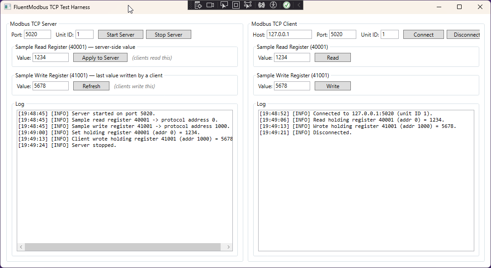

# Test.Modbus.FluentModbus

This is a sample application for testing FluentModbus for potential use with my network test toolset.

https://github.com/Apollo3zehn/FluentModbus/tree/dev

The WPF app targets **.NET Framework 4.8**, using **FluentModbus** (NuGet, `.NET Standard 2.0`
— compatible with 4.8). Server and client are separate `UserControl`s hosted side by side
in `MainWindow`.

- `ServerControl` — starts/stops a `ModbusTcpServer`, lets you set the sample read
  register and shows the last value written by a client.
- `ClientControl` — connects a `ModbusTcpClient`, reads the sample register, writes
  the sample register.
- `ModbusAddress` — converts traditional 4xxxx holding register numbers to the
  zero-based protocol addresses FluentModbus actually uses.

## Register mapping

| Label (4xxxx) | Purpose      | Protocol address |
|----------------|--------------|-------------------|
| 40001          | Sample read  | 0                 |
| 41001          | Sample write | 1000              |

## Setup

1. Open `ModbusFluentTest.sln` in Visual Studio 2026.
2. Restore NuGet (`FluentModbus`).
3. Run — port defaults to `5020` on both sides to avoid needing admin rights for 502.

## Usage

1. **Server** panel → Start Server.
2. **Client** panel → Connect (same port).
3. Client **Read** pulls 40001 from the server (set a value on the server side first
   with "Apply to Server" to see it flow through).
4. Client **Write** pushes a value into 41001; the server panel's write-register box
   updates automatically via the `RegistersChanged` event (click Refresh if it doesn't
   update immediately).

## Notes / things to verify on first build

- `RegistersChangedEventArgs` — the property holding the changed addresses is
  referenced here as `.Registers`; confirm this against IntelliSense/the installed
  package version and adjust if the compiler flags it, since docs samples only show
  it via an untyped lambda parameter.
- Values are read/written as `short` — FluentModbus supports arbitrary value types
  per register span (`ReadHoldingRegisters<T>`), so switch to `ushort`, `int`, `float`,
  etc. if your real registers use another width/type.
